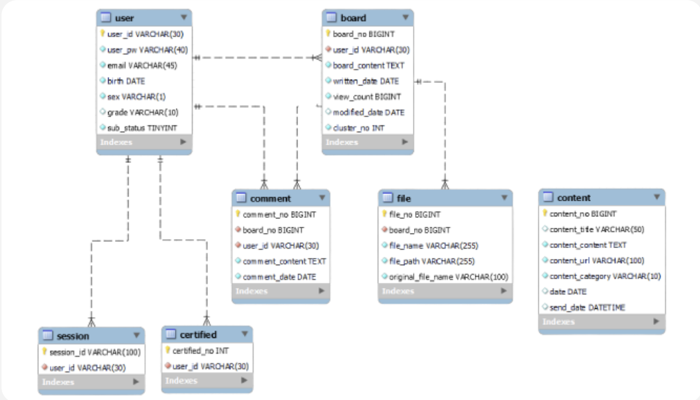

# Yellowbottle 프로젝트

제로웨이스트에 관심이 있는 사람들을 위한 의견 및 후기 공유 커뮤니티

# 프로젝트 기간

22.11.28일 ~ 22.12.23일

## 멤버구성

정계진: 백엔드, 서버배포  
박형규: 데이터 모델링, 데이터 시각화  
장우성: 프론트엔드, 백엔드  
이현지: 프론트엔드  
김민수: 데이터 모델링, 데이터 시각화  
박종서: 프론트엔드  

## 개발환경

Frontend - node: 18.12.0, npm: 8.19.2  
Backend - Springboot: 2.76, java: 1.8, Django: 4.14, Python: 3.8  
Modeling: LDA  
Visualization: GoogleAnalytics, Tableau   

### `사용기술`

### `아키텍쳐`

### `ERD`

