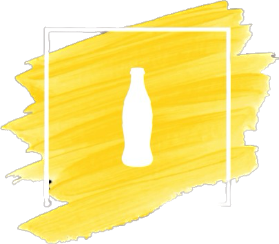
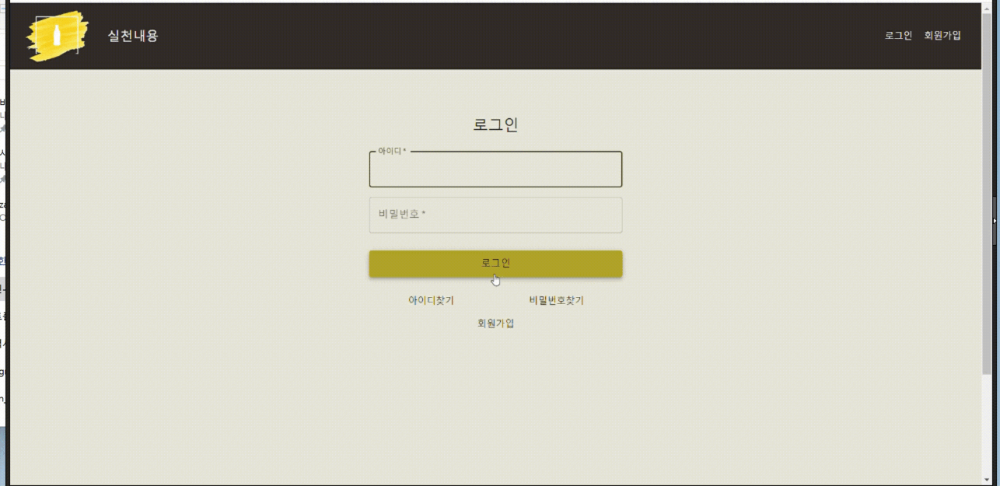
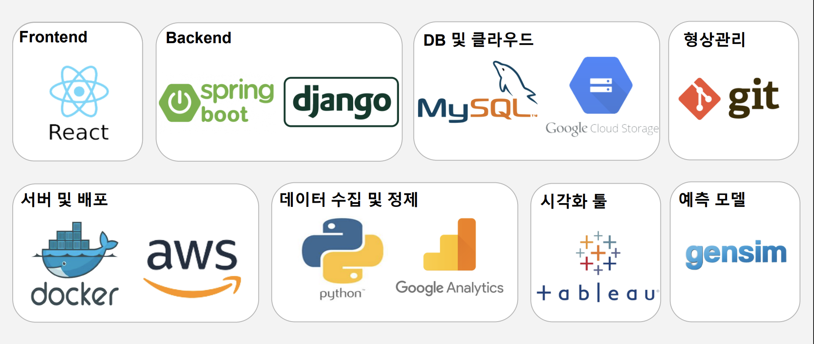
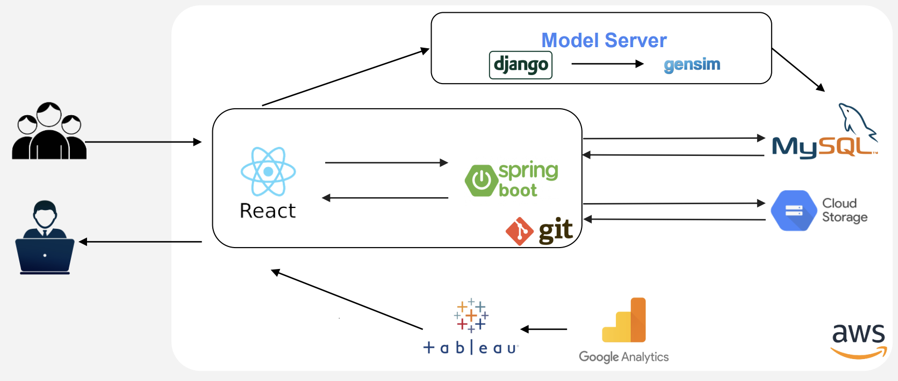
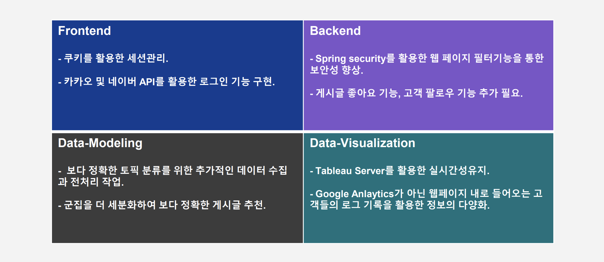

# Yellowbottle 프로젝트 

* 제로웨이스트에 관심이 있지만 실천에 부담을 느끼는 사람들을 대상으로 다양한 정보들을 제공해주며 부담없이 가볍게 제로웨이스트를 실천하고 이용후기들을 공유하는 서비스입니다. 

## 프로젝트 기간

* 22.11.28일 ~ 22.12.23일

## 기능 소개
* 유저들은 제로웨이스트의 실천후기들을 인피니티 스크롤을 이용해서 확인을 할 수 있습니다. 
* 유저들은 제로웨이스트, 비건, 플로깅등과 같은 다양한 소식들을 이메일을 통해서 전달받을 수 있습니다.
* 유저들은 게시글마다 해당 게시글의 내용을 분석해서 해당 게시글과 유사한 추천게시글들을 확인을 할 수 있습니다.
* 유저들의 마이페이지에서 유저의 실천내역들을 토대로 레벨 상태들을 확인할 수 있습니다.
* 관리자는 관리자화면에서 유저들이 웹페이지에서 어떤 경향을 보내는지 태블로 대시보드를 통해 확인을 할 수 있습니다.

## 화면 미리보기

메인화면

회원가입

로그인

게시글 확인

관리자 화면

메일 발송

## 멤버구성

* 정계진: 백엔드, 서버배포  
* 박형규: 데이터 모델링, 데이터 시각화  
* 장우성: 프론트엔드, 백엔드  
* 이현지: 프론트엔드, CSS  
* 김민수: 데이터 모델링, 데이터 시각화  
* 박종서: 프론트엔드, CSS  

## 개발환경

* Frontend - node: 18.12.0, npm: 8.19.2  
* Backend - Springboot: 2.76, java: 1.8, Django: 4.14, Python: 3.8  
* Modeling: LDA  
* Visualization: GoogleAnalytics, Tableau   

### `사용기술`
  
  
### `아키텍쳐`

  
## 추후 고려사항

